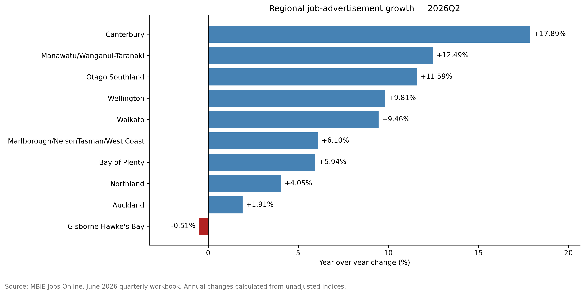
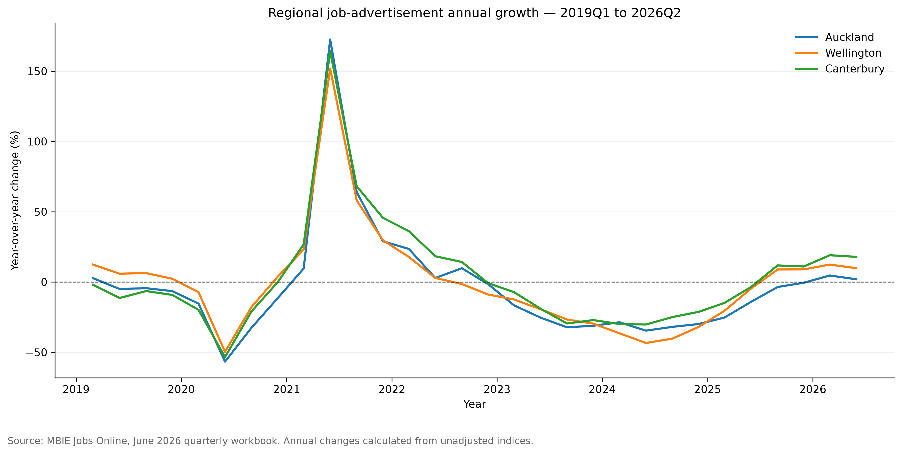
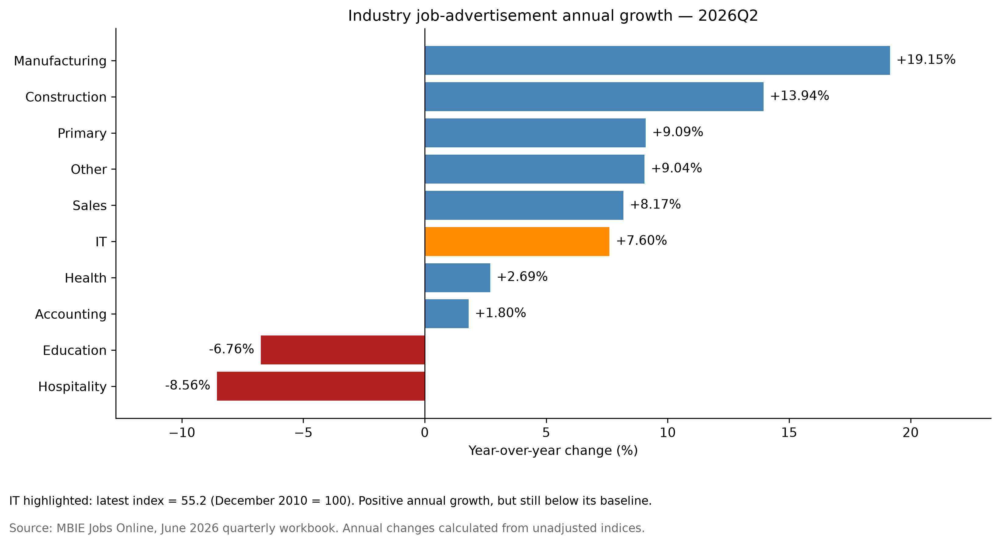

# NZ Job Market Data Analysis & ML

An end-to-end Python and data science portfolio project analyzing trends in New Zealand online job advertisements using official MBIE Jobs Online data.

## Project objective

This project will examine how online job-advertisement activity changes across industries, occupations, regions, and time. It will cover:

- Data loading and inspection
- Data cleaning and validation
- Exploratory data analysis
- Data visualization
- Feature engineering
- Machine-learning modelling
- Model evaluation and interpretation
- Conclusions and recommendations

> **Important:** MBIE Jobs Online primarily reports job-advertisement index data. Index values represent relative changes in online job advertisements and should not be interpreted as actual vacancy counts.

## Project structure

```text
├── data/
│   ├── raw/              # Original MBIE data
│   └── processed/        # Cleaned and transformed data
├── models/               # Saved machine-learning models
├── notebooks/            # Jupyter notebooks
├── reports/
│   └── figures/          # Exported charts and visualizations
├── src/                  # Reusable Python modules
├── .gitignore
├── README.md
└── requirements.txt
```

# Data sources

This project uses official Jobs Online data published by New Zealand's Ministry of Business, Innovation and Employment (MBIE).

Source page:  
https://www.mbie.govt.nz/business-and-employment/employment-and-skills/labour-market-reports-data-and-analysis/jobs-online

## Quarterly dataset

- File: `jobs-online-all-vacancies-unadjusted-quarterly-june-2026.xlsx`
- Coverage: through the June 2026 quarter
- Format: Excel
- Worksheet: `Data`
- Purpose: regional, industry, occupation and skill-level analysis

## Interpretation

Jobs Online tracks changes in online job advertisements using index values. The values are not actual vacancy counts. The series is unadjusted, so seasonal patterns may remain in the data.

## Raw-data policy

Files in `data/raw/` are preserved without modification and excluded from Git. Cleaned and transformed datasets will be generated reproducibly from the source files.

## Regional job-advertisement growth



In 2026Q2, nine of ten regional groupings recorded annual growth.
Canterbury led at 17.89%, while Gisborne Hawke's Bay declined by 0.51%.

These growth rates describe changes in online job-advertisement indices,
not regional vacancy counts.

## Regional growth over time



All three regions recorded their highest annual growth in 2021Q2,
partly reflecting the low 2020Q2 comparison base.

Auckland had the largest one-year rebound (172.53%), but Wellington
had the largest increase from 2019Q2 to 2021Q2 (26.70%, compared with
Canterbury's 22.99% and Auckland's 18.07%).

Growth rates should therefore be interpreted alongside index levels
and clearly specified comparison periods.

### Recent growth versus historical peaks

In 2026Q2, all ten regional indices remained below their observed
historical peaks. Auckland, Wellington, Bay of Plenty, and
Marlborough/NelsonTasman/West Coast showed positive annual growth
but were still more than 50% below their respective peaks.

Recent growth therefore does not necessarily indicate a return to
earlier index levels. These comparisons use unadjusted indices,
with peaks occurring in different quarters.

## Industry job-advertisement growth



Eight of ten industries recorded positive annual growth in 2026Q2.
Manufacturing led at 19.15%, while Hospitality recorded the largest
decline at 8.56%.

IT ranked sixth for annual growth at 7.60%. However, its index remained
at 55.2 against a December 2010 baseline of 100, illustrating that
recent growth can coexist with a below-baseline index level.

These unadjusted indices measure relative changes in online job
advertisements, not vacancy counts or industry market shares.
Comparisons with the December 2010 baseline span different seasons.
