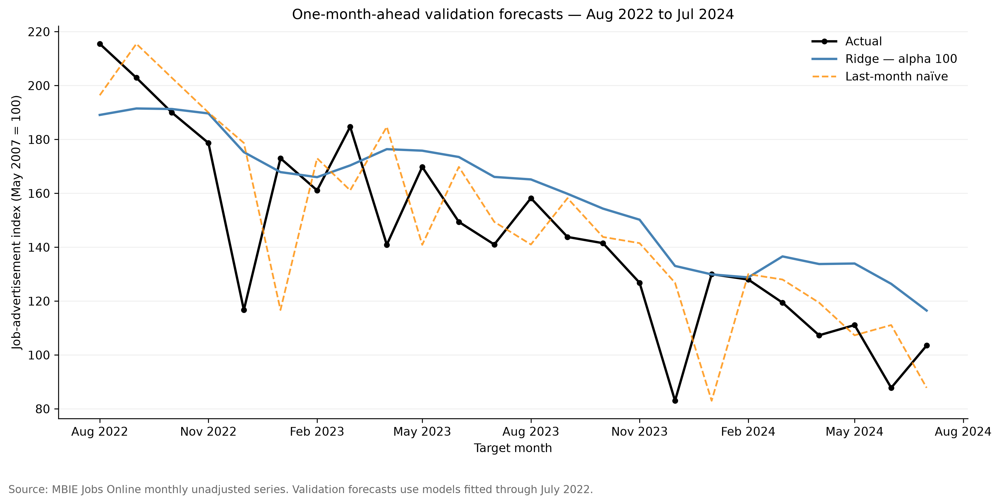
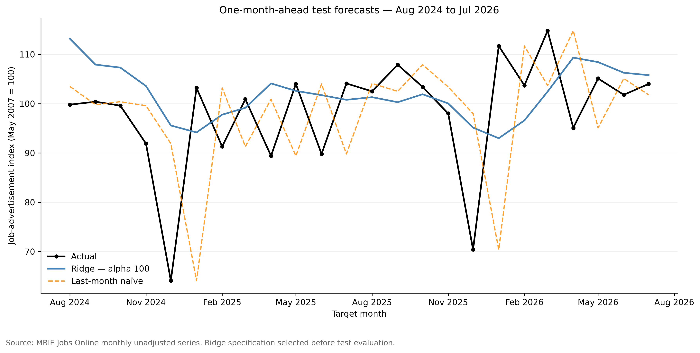

# NZ Job Market Data Analysis & ML

An end-to-end Python and data science portfolio project analysing trends in New Zealand online job advertisements using official MBIE Jobs Online data.

## Project overview

This project covers data loading, cleaning, validation, exploratory analysis, visualisation, time-series feature engineering, machine-learning model selection, and held-out test evaluation.

The quarterly analysis examines regional, industry, occupation, and skill-level trends from 2010Q4 to 2026Q2. The monthly forecasting analysis uses observations from May 2007 to July 2026 to predict the overall job-advertisement index one month ahead.

> **Important:** MBIE Jobs Online reports index values representing relative changes in online job advertisements. These values are not vacancy counts, and the source series used here is not seasonally adjusted.

## Key results

| Area                 | Finding                                                                                              |
| -------------------- | ---------------------------------------------------------------------------------------------------- |
| Regional growth      | Canterbury recorded the strongest year-over-year growth in 2026Q2 at 17.89%.                         |
| Industry growth      | Manufacturing recorded the strongest industry growth in 2026Q2 at 19.15%.                            |
| Occupation growth    | Machinery Drivers recorded the strongest occupation growth in 2026Q2 at 19.84%.                      |
| Broad skill growth   | The Unskilled index grew 10.21%, compared with 5.51% for the Skilled index and 6.72% overall.        |
| Selected model       | Ridge regression with `alpha=100` was selected using validation MAE.                                 |
| Held-out test        | Ridge achieved an MAE of 9.14 and RMSE of 11.88 over the 24-month test period.                       |
| Baseline improvement | Ridge reduced test MAE by 25.84% compared with the last-month naive baseline.                        |
| Deployment forecast  | After retraining on all model-ready observations, the model forecast an August 2026 index of 104.56. |

The held-out test covers August 2024 through July 2026. The August 2026 forecast was generated after retraining on all available observations and is not part of the held-out evaluation.

## Tools

Python, Pandas, NumPy, Matplotlib, scikit-learn, Joblib, Jupyter, OpenPyXL, and pytest.

## Repository structure

```text
├── data/
│   ├── raw/              # Original MBIE files (not tracked by Git)
│   └── processed/        # Reproducibly generated cleaned datasets
├── models/               # Saved model artifacts (not tracked by Git)
├── notebooks/            # Analysis and modelling notebooks
├── reports/
│   └── figures/          # Exported charts
├── src/                  # Reusable forecasting code
├── tests/                # Automated tests
├── .gitignore
├── README.md
└── requirements.txt
```

## Data sources

The project uses official Jobs Online data published by New Zealand's Ministry of Business, Innovation and Employment (MBIE):

- [MBIE Jobs Online](https://www.mbie.govt.nz/business-and-employment/employment-and-skills/labour-market-reports-data-and-analysis/jobs-online)
- `jobs-online-all-vacancies-unadjusted-quarterly-june-2026.xlsx`
- `jol-monthly-unadjusted-series-from-may-2007-july-2026.csv`

The quarterly workbook supports regional, industry, occupation, and skill-level analysis. The monthly file supports validation and one-month-ahead forecasting.

The monthly indices use May 2007 as their baseline, while the quarterly indices use December 2010. The datasets are analysed separately, and their index levels are not directly compared.

Files in `data/raw/` are preserved without modification and excluded from Git. Processed datasets are generated from the source files by the notebooks.

## Analysis workflow

Run the notebooks in order:

| Notebook                             | Purpose                                                                                        |
| ------------------------------------ | ---------------------------------------------------------------------------------------------- |
| `01_data_loading.ipynb`              | Inspect and clean the quarterly regional data.                                                 |
| `02_regional_analysis.ipynb`         | Analyse regional growth, trends, and historical peaks.                                         |
| `03_industry_analysis.ipynb`         | Clean and analyse industry indices.                                                            |
| `04_occupation_skill_analysis.ipynb` | Analyse occupation and skill-level indices.                                                    |
| `05_monthly_data_inspection.ipynb`   | Inspect, validate, and export the monthly dataset.                                             |
| `06_monthly_forecasting.ipynb`       | Engineer features, compare models, evaluate the final model, and save the deployment pipeline. |

## Quarterly analysis

### Regional job-advertisement growth


In 2026Q2, nine of ten regional groupings recorded annual growth. Canterbury led at 17.89%, while Gisborne Hawke's Bay declined by 0.51%. These rates describe changes in online job-advertisement indices, not regional vacancy counts.

### Regional growth over time


Auckland, Wellington, and Canterbury recorded their highest annual growth in 2021Q2. These exceptionally high rates coincide with low comparison values in 2020Q2, so the growth rates should be interpreted alongside index levels and clearly specified comparison periods.

Auckland had the largest one-year rebound at 172.53%. Over the longer comparison from 2019Q2 to 2021Q2, Wellington increased by 26.70%, Canterbury by 22.99%, and Auckland by 18.07%.

In 2026Q2, all ten regional indices remained below their observed historical peaks. Auckland, Wellington, Bay of Plenty, and Marlborough/NelsonTasman/West Coast recorded positive annual growth but remained more than 50% below their respective peaks. Recent growth therefore does not necessarily indicate a return to earlier index levels.

### Industry job-advertisement growth


Eight of ten industries recorded positive annual growth in 2026Q2. Manufacturing led at 19.15%, while Hospitality recorded the largest decline at 8.56%.

IT ranked sixth for annual growth at 7.60%, but its index remained at 55.2 against a December 2010 baseline of 100. This illustrates that recent growth can coexist with a below-baseline index level.

### Occupation and skill-level growth


Seven of eight occupation groups recorded annual growth in 2026Q2. Machinery Drivers led at 19.84%, while Community & Personal Services declined by 0.18%.

Four of five detailed skill categories grew. The `unskilled` category led at 12.12%, while the detailed `skilled` category declined by 0.30%.

| Broad series            | Annual growth | Difference from overall growth |
| ----------------------- | ------------: | -----------------------------: |
| Skilled                 |         5.51% |        -1.21 percentage points |
| Unskilled               |        10.21% |        +3.49 percentage points |
| ALL (overall benchmark) |         6.72% |                              — |

Broad `Skilled` combines highly skilled, skilled, and semi-skilled categories. Broad `Unskilled` combines low skilled and unskilled categories. The detailed and broad categories are therefore not interchangeable.

## Monthly forecasting

### Data validation

The monthly dataset contains 231 consecutive observations from May 2007 to July 2026. Validation confirmed unique dates, a complete monthly timeline, and no missing source values.

Annual growth was independently calculated from the published overall index. The first 12 calculated values remain missing because the file does not contain the required preceding-year observations. The largest absolute difference between the reported and independently calculated annual-change series was approximately 0.459 percentage points in April 2021; the cause was not established.

### Forecasting objective and features

The modelling objective is to predict the next month's overall job-advertisement index using only preceding observations. The target remains an index—not a vacancy count or growth percentage.

The final feature set contains:

- index lags of 1, 2, 3, and 12 months;
- a trailing 12-month mean that excludes the target month; and
- sine and cosine encodings of the target calendar month.

A three-month rolling mean was removed because it duplicated the information already represented by lags 1, 2, and 3.

### Chronological evaluation design

| Split         | Target months         | Observations |
| ------------- | --------------------- | -----------: |
| Training      | May 2008–July 2022    |          171 |
| Validation    | August 2022–July 2024 |           24 |
| Reserved test | August 2024–July 2026 |           24 |

The first 12 source months provide historical inputs but lack sufficient history to serve as training targets. The data was not randomly shuffled. Predictions were evaluated one month ahead, with preceding actual observations becoming available over time.

### Validation and model selection

| Model                          | Validation MAE | Validation RMSE |
| ------------------------------ | -------------: | --------------: |
| Ridge — alpha 100              |      **18.83** |           24.01 |
| Random Forest                  |          19.13 |           24.73 |
| Linear regression — 7 features |          19.38 |       **23.24** |
| Last-month naive               |          21.50 |           27.12 |
| Seasonal naive                 |          40.21 |           43.03 |

Errors are measured in index points, and lower values are better. Ridge with `alpha=100` was selected because MAE was defined as the primary selection metric before test evaluation. Linear regression achieved the lowest validation RMSE, illustrating that model rankings can differ by metric.



The selected Ridge model overpredicted 19 of 24 validation months and had a mean signed error of +14.05 index points. Its smoother predictions did not fully capture several sharp monthly changes, showing why aggregate metrics should be examined alongside forecast behaviour.

### Final held-out test results

After model selection, the Ridge specification was retrained using training and validation observations through July 2024. It was then evaluated once on the reserved August 2024–July 2026 test period.

| Model             | Test MAE | Test RMSE | Mean signed error |
| ----------------- | -------: | --------: | ----------------: |
| Ridge — alpha 100 | **9.14** | **11.88** |             +3.81 |
| Last-month naive  |    12.33 |     16.58 |             -0.02 |
| Seasonal naive    |    16.13 |     22.51 |             +9.25 |

Ridge reduced MAE by **25.84%** and RMSE by **28.35%** relative to the last-month naive benchmark.



Ridge outperformed both naive benchmarks across the 24 test months. Its predictions were smoother than the actual series, retained a modest overprediction tendency, and did not capture every sharp monthly change. These results apply only to the defined historical test period and do not guarantee future performance.

### Deployment model and next-month forecast

After final test evaluation, the frozen Ridge specification was retrained on all 219 model-ready observations through July 2026. The fitted pipeline was saved with Joblib and successfully reloaded, with the reloaded and in-memory models producing matching predictions.

Using observations available through July 2026, the deployment model forecast an August 2026 overall index of **104.56**. Because this operational model includes the former test observations in its training data, the held-out test metrics above belong to the frozen evaluation model—not to the retrained deployment artifact.

## Limitations

- The analysis uses a single historical data snapshot rather than archived releases available at each historical forecast date.
- Publication delays mean an observation-month-ahead prediction is not necessarily issued before the target month begins.
- The source series is unadjusted and may retain seasonal patterns.
- Index movements cannot be interpreted as changes in vacancy counts or employment shares.
- Observed patterns support descriptive conclusions but do not, by themselves, establish their causes.
- Historical evaluation does not guarantee future forecasting performance.

## Reproduce the project

Clone the repository and create a virtual environment:

```bash
git clone https://github.com/kamalpreetsinghh/nz-job-market-data-analysis.git
cd nz-job-market-data-analysis
python3 -m venv .venv
source .venv/bin/activate
python -m pip install --upgrade pip
python -m pip install -r requirements.txt
```

Download the two MBIE source files listed in [Data sources](#data-sources), place them in `data/raw/`, and run the notebooks in numerical order. The notebooks generate the processed datasets, figures, and local deployment model used by the forecast script.

Launch JupyterLab:

```bash
jupyter lab
```

After running the notebooks, reproduce the next-month forecast:

```bash
python src/forecasting.py
```

Expected output for the included July 2026 data endpoint:

```text
Forecast month: 2026-08
Predicted overall index: 104.56
```

## Automated testing

The `pytest` suite verifies that one-month-ahead lag, rolling-average, and seasonal features are calculated correctly. It also confirms that missing target values and gaps in the monthly timeline are rejected.

Run the tests from the project root:

```bash
python -m pytest -v
```

## Conclusion

The analysis shows that growth rates, index levels, and historical peaks answer different questions and should be interpreted together. In 2026Q2, most regional, industry, occupation, and skill groupings recorded positive annual growth, but the strength of that growth varied substantially and some series remained below their baselines or historical peaks.

For one-month-ahead forecasting, the selected Ridge model improved upon both naive benchmarks during the reserved 24-month test period. Its smoother forecasts handled the recent level of the series well overall but were less responsive to abrupt monthly movements. The model is therefore best presented as a transparent benchmark for this dataset rather than a definitive prediction system.
