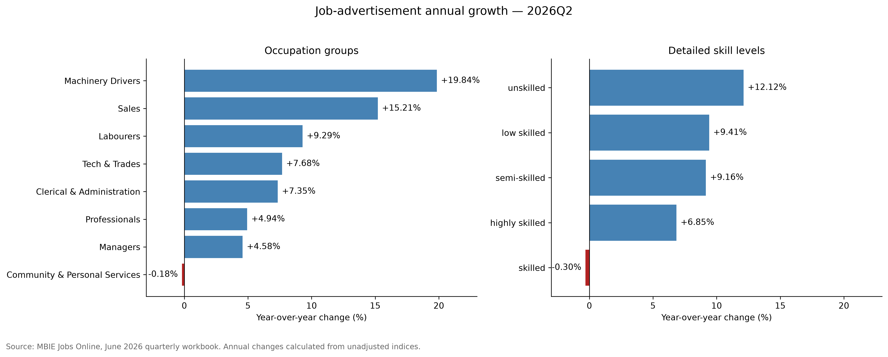

# NZ Job Market Data Analysis & ML

An end-to-end Python and data science portfolio project analyzing trends in New Zealand online job advertisements using official MBIE Jobs Online data.

## Project objective

This project will examine how online job-advertisement activity changes across industries, occupations, regions, and time. It will cover:

- Data loading and inspection
- Data cleaning and validation
- Exploratory data analysis
- Data visualization
- Feature engineering
- Machine-learning modelling
- Model evaluation and interpretation
- Conclusions and recommendations

> **Important:** MBIE Jobs Online primarily reports job-advertisement index data. Index values represent relative changes in online job advertisements and should not be interpreted as actual vacancy counts.

## Project structure

```text
├── data/
│   ├── raw/              # Original MBIE data
│   └── processed/        # Cleaned and transformed data
├── models/               # Saved machine-learning models
├── notebooks/            # Jupyter notebooks
├── reports/
│   └── figures/          # Exported charts and visualizations
├── src/                  # Reusable Python modules
├── .gitignore
├── README.md
└── requirements.txt
```

# Data sources

This project uses official Jobs Online data published by New Zealand's Ministry of Business, Innovation and Employment (MBIE).

Source page:  
https://www.mbie.govt.nz/business-and-employment/employment-and-skills/labour-market-reports-data-and-analysis/jobs-online

## Quarterly dataset

- File: `jobs-online-all-vacancies-unadjusted-quarterly-june-2026.xlsx`
- Coverage: through the June 2026 quarter
- Format: Excel
- Worksheet: `Data`
- Purpose: regional, industry, occupation and skill-level analysis

## Interpretation

Jobs Online tracks changes in online job advertisements using index values. The values are not actual vacancy counts. The series is unadjusted, so seasonal patterns may remain in the data.

## Raw-data policy

Files in `data/raw/` are preserved without modification and excluded from Git. Cleaned and transformed datasets will be generated reproducibly from the source files.

## Regional job-advertisement growth


In 2026Q2, nine of ten regional groupings recorded annual growth.
Canterbury led at 17.89%, while Gisborne Hawke's Bay declined by 0.51%.

These growth rates describe changes in online job-advertisement indices,
not regional vacancy counts.

## Regional growth over time


All three regions recorded their highest annual growth in 2021Q2,
partly reflecting the low 2020Q2 comparison base.

Auckland had the largest one-year rebound (172.53%), but Wellington
had the largest increase from 2019Q2 to 2021Q2 (26.70%, compared with
Canterbury's 22.99% and Auckland's 18.07%).

Growth rates should therefore be interpreted alongside index levels
and clearly specified comparison periods.

### Recent growth versus historical peaks

In 2026Q2, all ten regional indices remained below their observed
historical peaks. Auckland, Wellington, Bay of Plenty, and
Marlborough/NelsonTasman/West Coast showed positive annual growth
but were still more than 50% below their respective peaks.

Recent growth therefore does not necessarily indicate a return to
earlier index levels. These comparisons use unadjusted indices,
with peaks occurring in different quarters.

## Industry job-advertisement growth


Eight of ten industries recorded positive annual growth in 2026Q2.
Manufacturing led at 19.15%, while Hospitality recorded the largest
decline at 8.56%.

IT ranked sixth for annual growth at 7.60%. However, its index remained
at 55.2 against a December 2010 baseline of 100, illustrating that
recent growth can coexist with a below-baseline index level.

These unadjusted indices measure relative changes in online job
advertisements, not vacancy counts or industry market shares.
Comparisons with the December 2010 baseline span different seasons.

## Occupation and skill-level growth



Seven of eight occupation groups recorded annual growth in 2026Q2.
Machinery Drivers led at 19.84%, while Community & Personal Services
declined by 0.18%.

Four of five detailed skill categories grew. The `unskilled` category
led at 12.12%, while the detailed `skilled` category declined by 0.30%.

### Broad skill comparison

| Series                  | Annual growth | Difference from overall growth |
| ----------------------- | ------------: | -----------------------------: |
| Skilled                 |         5.51% |        −1.21 percentage points |
| Unskilled               |        10.21% |        +3.49 percentage points |
| ALL (overall benchmark) |         6.72% |                              — |

Broad `Skilled` combines highly skilled, skilled, and semi-skilled
categories. Broad `Unskilled` combines low skilled and unskilled.
The detailed and broad categories are therefore not interchangeable.

These unadjusted indices measure relative changes in advertisements,
not vacancy counts or employment shares.

## Monthly data and forecasting

The forecasting phase uses MBIE's monthly Jobs Online dataset,
covering May 2007–July 2026. It contains 231 consecutive monthly
observations.

The monthly indices use May 2007 as their baseline, while the quarterly
indices use December 2010. The datasets are analysed separately;
their index levels are not directly compared.

### Data validation

Checks confirmed a complete monthly timeline, unique dates, and no
missing source values.

Annual growth was independently calculated from the published overall
index. The first 12 calculated values remain missing because the file
does not contain preceding-year observations.

The supplied annual-change field was preserved separately. Its largest
absolute difference from the independently calculated series was
approximately 0.459 percentage points in April 2021. The cause of this
discrepancy has not been established.

### Forecasting objective

Predict the next month's overall job-advertisement index—not vacancy
counts—using preceding observations once published.

The initial model uses seven features:

- Index lags of 1, 2, 3, and 12 months
- A trailing 12-month mean, excluding the target month
- Sine and cosine encodings of the target calendar month

A three-month rolling mean was removed because it duplicated
information in lags 1, 2, and 3.

### Evaluation design

| Split         | Target months         | Observations |
| ------------- | --------------------- | -----------: |
| Training      | May 2008–July 2022    |          171 |
| Validation    | August 2022–July 2024 |           24 |
| Reserved test | August 2024–July 2026 |           24 |

The first 12 source months provide historical inputs but lack sufficient
history to serve as training targets.

Evaluation is chronological, without random shuffling. Predictions are
made one month ahead, with prior-month observations incorporated as
they become available. Linear regression coefficients remain fixed
throughout validation.

### Preliminary validation results

| Model                          |   MAE |  RMSE |
| ------------------------------ | ----: | ----: |
| Ridge — alpha 100              | 18.83 | 24.01 |
| Linear regression — 7 features | 19.38 | 23.24 |
| Last-month naive               | 21.50 | 27.12 |
| Seasonal naive                 | 40.21 | 43.03 |

Errors are measured in index points; lower is better.
Ridge achieved the lowest validation MAE among the evaluated models.
Linear regression reduced validation MAE by approximately 9.9% and
RMSE by 14.3% relative to last-month naive.

These are preliminary validation results. Final test performance has
not been evaluated.

### Forecasting limitations

- The analysis uses one historical data snapshot rather than archived
  releases available at each historical forecast date.
- Publication delays mean an observation-month-ahead prediction is
  not necessarily issued before the target month begins.
- The series is unadjusted and may contain seasonal patterns.
- Validation improvements do not guarantee future performance.

### Monthly source file

`jol-monthly-unadjusted-series-from-may-2007-july-2026.csv`

[Official MBIE Jobs Online source](https://www.mbie.govt.nz/business-and-employment/employment-and-skills/labour-market-reports-data-and-analysis/jobs-online)
